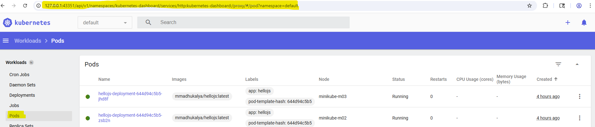
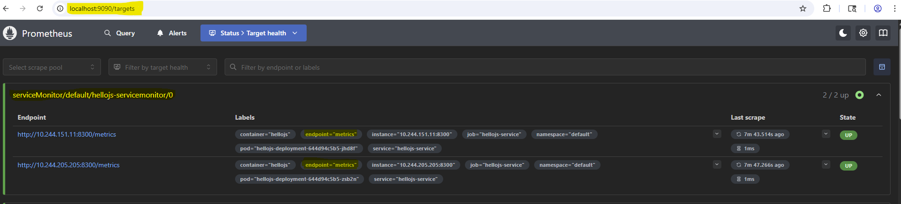
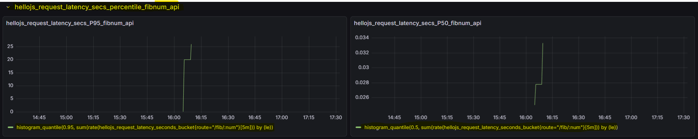

# Request latency percentiles using Prometheus histograms
Emit Prometheus histogram metrics for request latency percentiles. 

## Implementation
Javascript Prometheus client used: `prom-client`. The following are the steps:

<li> Create Prometheus metric client registry and add default metrics to client registry

```javascript
// Prometheus metric client registry
const registry = new client.Registry();

// Add default metrics to client registry
client.collectDefaultMetrics({ registry });
```

<li> Add histogram for calculating latency in seconds of fib calculation method. register histogram with Prometheus metric client registry

```javascript
// histogram for latency in seconds of fib calculation method
const request_latency_seconds = new client.Histogram({
  name: 'hellojs_request_latency_seconds',
  help: 'request latency in seconds',
  labelNames: ['route'],
  buckets: [0.05, 0.1, 0.25, 0.5, 1, 2.5, 5, 10, 30, 60]
});
registry.registerMetric(request_latency_seconds);
```

<li> Emit histogram metric for latency calculation in seconds for the fibbonacci method from code.

```javascript
// Fibonacci endpoint
app.get('/api/v1/fib/:num', (req, res) => {
    const end = request_latency_seconds.startTimer({ route: '/fib/:num' });
    // implementation details
    end();
});
```

## Kubernetes (k8s) deployment
The project is deployed using a 3-node local `minikube` cluster. 

```shell
m_mad@Ryzen7:~$ minikube node list
minikube        192.168.49.2
minikube-m02    192.168.49.3
minikube-m03    192.168.49.4
```

The deployment artifacts consists of: a deployment yaml for application, a service yaml for service and a third yaml file for service monitors to allow `Prometheus` to discover and scrape metrics from the app's `/metrics` endpoint. They can be found inside the `k8s` folder.



The docker image for the app is available at: 
[image](https://hub.docker.com/repository/docker/mmadhukalya/hellojs/general)

## Monitoring using Prometheus and Grafana
Prometheus is set up via Kubernetes Prometheus operator using `helm`. 

```shell
helm repo add prometheus-community https://prometheus-community.github.io/helm-charts
helm repo update
helm install prometheus-stack prometheus-community/kube-prometheus-stack --namespace monitoring --create-namespace
```

Ensure that Prometheus targets show the scrapping endpoint of the app. 



In the final step, set up Grafana dashboards to show histogram metrics for the app. Send a few requests to ensure that the histogram values show up for `P95` and `P50` percentiles.



Overall `P95` latency for the fibnoccai number calculating api is around `~26 secs` whereas `P50` latency for the same is around `~0.03 secs` - which means the data points consists of a few large outliers.
